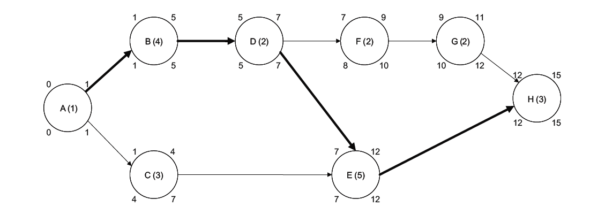
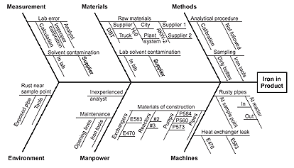

# MBA 511
___

### Chapter 01

$Receivable Turnover = \frac{Annual Credit Sales}{Average Account Receivable}$


$Inventory Turnover = \frac{Cost of Goods Sold}{Average Inventory Value}$

$Asset Turnover = \frac{Revenue (or Sales)}{Total Assets}$

```Quicker payments will reduce the average amount of accounts receivables, so the receivables turnover ratio will increase.```


______
### Chapter 4


___
### Calculating averages

###### Simple moving average
$\frac{\sum_{1}^{n}W_i}{n}$

###### Weighted moving average
<a href="https://www.codecogs.com/eqnedit.php?latex=$X_1*W_1&plus;X_2*W_2&plus;X_3*W_3&plus;...&plus;X_n*W_n$" target="_blank"></a>

<a href="https://www.codecogs.com/eqnedit.php?latex=Where&space;$\sum_{n}W_n&space;=&space;1$" target="_blank"></a>

###### Littles Law
<a href="https://www.codecogs.com/eqnedit.php?latex=$L&space;=&space;\lambda&space;W$" target="_blank"></a>
Where L is Average number of customers in the store
<a href="https://www.codecogs.com/eqnedit.php?latex=$\lambda$" target="_blank"></a> is the effective arrival rate
W is Average time customer spends in store
___
### Chapter 12

##### Six sigma charts
Chart examples are on page 305 of the textbook

* Flow Charts
  * Used in the define stage of a product
* Run charts
  * Depict trends over time and hepl in the define stage
* Pareto charts
	* These charts help to break down a problem into the relative contributions of its components, based on the idea that 80% of problems are caused by 20% of causes
* Checksheets
	* These are basic forms that help standardize data collections.
* Fishbone (aka Cause and Effect Diagram)
	* To construct, start with a why? question. Why are pizza deliveries late on Friday and Saturday nights?
	* The rest consists of lines drawn across the page, attached to the problem statement, and several lines or "bones" coming out vertically from the main line.
	
	Fishbone diagram example
	