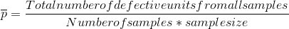
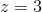
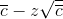

# MBA 511 Final Exam Study Guide
___
### Calculating averages

###### Simple moving average
<a href="https://www.codecogs.com/eqnedit.php?latex=\frac{\sum_{1}^{n}W_i}{n}" target="_blank"></a>

In other words, the average of the N most recent items

###### Weighted moving average
<a href="https://www.codecogs.com/eqnedit.php?latex=$X_1*W_1&plus;X_2*W_2&plus;X_3*W_3&plus;...&plus;X_n*W_n$" target="_blank"></a>

<a href="https://www.codecogs.com/eqnedit.php?latex=Where&space;$\sum_{n}W_n&space;=&space;1$" target="_blank"></a>

###### Exponential Smoothing


 The exponentially smoothed forecast for period *t*
 The exponentially smoothed forecast made for the prior period	
 The actual demand in the prior period
 The desired response rate, or smoothing constant

###### Little's Law
<a href="https://www.codecogs.com/eqnedit.php?latex=$L&space;=&space;\lambda&space;W$" target="_blank"></a>
Where L is Average number of customers in the store
<a href="https://www.codecogs.com/eqnedit.php?latex=$\lambda$" target="_blank"></a> is the effective arrival rate
W is Average time customer spends in store
___
### Chapter 01

<a href="https://www.codecogs.com/eqnedit.php?latex=Receivable&space;Turnover&space;=&space;\frac{Annual&space;Credit&space;Sales}{Average&space;Account&space;Receivable}" target="_blank"></a>


<a href="https://www.codecogs.com/eqnedit.php?latex=Inventory&space;Turnover&space;=&space;\frac{Cost&space;of&space;Goods&space;Sold}{Average&space;Inventory&space;Value}" target="_blank"></a>

<a href="https://www.codecogs.com/eqnedit.php?latex=Asset&space;Turnover&space;=&space;\frac{Revenue&space;(or&space;Sales)}{Total&space;Assets}" target="_blank"></a>

```Quicker payments will reduce the average amount of accounts receivables, so the receivables turnover ratio will increase.```


______
### Chapter 4 Critical Path Method

* Top left - Early Start
* Top right - Early Finish
* Bottom left - Late Start
* Bottom right - Late Finish

First propagate through the early starts. Once that is calculated, use back propagation to determine late start.

`Late Start - Early Start = Slack Time`

**Any path with 0 slack time is part of the critical path**


___
### Chapter 10 Waiting Line Analysis and Simulation

#### Phases and Channels
* Single channel, Single phase
	* Only one line, only one station
	* **Typical example is a single chair barbershop**
* Single channel, Multi phase
	* Only one line, multiple stations
	* **Typical example is a car wash**
		* Users move through vacuums, wetting, washing, rinsing, ect.
* Multichannel, single phase
	* Multiple lines to go through, but each station provides only a single stop
	* **Typical example is a bank teller**
		* A bank has multiple tellers, but a customer will only visit a single teller
* Multichannel, multiphase
	* Multiple lines for multiple services. Similar to a bank teller, except multiple stations.
	* **Typical example is a hospital admission.**
		* User must go to triage, insurance, reception, ect. and multiple help desks exist

**Examples of working line problems start on page 231 of the textbook**

___
### Chapter 12 Six Sigma
##### Methodology
1. **Define (D)**
	* Identify customers and their priorities.
	* Identify a project suitable for Six Sigma efforts based on business objectives as well as customer needs and feedback.
	* Identify critical-to-quality characteristics (CTQs) that the customer believes have the most impact on quality.
2. **Measure (M)**
	* Determine how to measure the process and how it is performing.
	* Identify the key internal process that influence CTQs and measure the defects currently generated relative to those processes.
3. **Analyze (A)**
	* Determine the most likely causes of defects.
	* Understand why defects are generated by identifying the key variables most likely to create process variation.
4. **Improve (I)**
	* Identify means to remove the cause of defects
	* Confirm the key variables and quantify their effects on the CTQs.
	* Identify the maximum acceptance ranges of the key variables and a system for measuring deviations of the variables.
	* Modify the process to stay within an acceptable range.
5. **Control (C)**
	* Determine how to maintain the improvements
	* Put tools in place to ensure that the key variables remain within the maximum acceptance ranges under the modified process.

##### Six sigma charts
Chart examples are on page 305 of the textbook

* Flow Charts
  * Used in the define stage of a product
* Run charts
  * Depict trends over time and help in the define stage
* Pareto charts
	* These charts help to break down a problem into the relative contributions of its components, based on the idea that 80% of problems are caused by 20% of causes
* Checksheets
	* These are basic forms that help standardize data collections.
* Fishbone (aka Cause and Effect Diagram)
	* To construct, start with a why? question. Why are pizza deliveries late on Friday and Saturday nights?
	* The rest consists of lines drawn across the page, attached to the problem statement, and several lines or "bones" coming out vertically from the main line.
	
	Fishbone diagram example
	


___
## Chapter 13 Quality Control

##### P-charts
###### Used when a product is either good or it is bad



Standard deviation

UCL

LCL

*z* is confidence rating. A typical value is  (99.7% confidence) or  (99% confidence)
_____
##### C-charts
###### Used when the product can have multiple defects; such as a board of lumber with more than one knot

 Average number of defects per unit
Standard deviation

UCL
UCL = 
LCL
LCL =  or 0, whichever is greater

Same typical z values as p-charts

___
##### X-Bar and R-Charts
###### Used when taking samples that must fall within an acceptable range
**See Page 329 of the textbook**

Number of observations in each sample | $A_2$| $D_3$ | $D_4$
---|---|---|---
2|1.88|0|3.27
3|1.02|0|2.57
4|0.73| 0|2.28
5|0.58| 0|2.11
6|0.48| 0|2.00
7|0.42|0.08 |1.92
8| 0.37|0.14 |1.86
9|0.34 |0.18|1.82
10|0.31 |0.22|1.78
11|0.29|0.26|1.74
12|0.27|0.28|1.72
13|0.25|0.31|1.69
14|0.24|0.33|1.67
15|0.22|0.35|1.65
16|0.21|0.36|1.64
17|0.20|0.38|1.62
18|0.19|0.39|1.61
19|0.19|0.40|1.60
20|0.18|0.41|1.59

**Upper control limit for** $\overline{X} = \overline{\overline{x}}+A_2\overline{R}$

**Lower control limit for** $\overline{X} = \overline{\overline{X}}{A_2\overline{R}}$

**Upper control limit for** $R = D_4 \overline{R}$

**Lower control limit for** $R = D_3 \overline{R}$


___
## Chapter 23 Theory of Constraints

Eli Goldratt in his book *The Goal* observed that improving flow time through a resource that was not a bottleneck would not improve over all production time.

Goldratt's Rules of Production Scheduling
1. Do not balance capacity - balance the flow
2. The level of utilization of a nonbottleneck resource is determined not by its own potential but by some other constraint in the system.
3. Utilization and activation of a resource are not the same.
4. An hour lost at a bottleneck is an hour lost for the entire system
5. An hour saved at a nonbottleneck is a mirage.
6. Bottlenecks govern both throughput and inventory in the system.
7. The transfer batch may not, and many times should not, be equal to the process batch.
8. A process batch should be variable both along its route and in time.
9. Priorities can be set only by examining the system's constraints. Lead time is a derivative of the schedule.